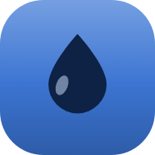
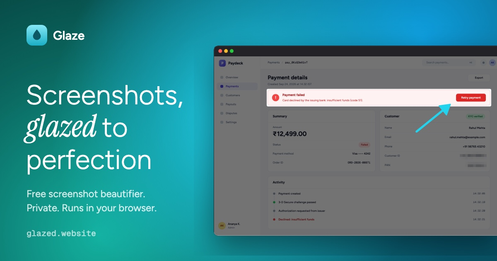

<p align="center">
  
</p>

<h1 align="center">Glaze</h1>

<p align="center">
  <b>The easiest way to edit a screenshot.</b><br />
  Crop it, blur what's private, highlight what matters, copy it. No sign-up. Nothing uploads.
</p>

<p align="center">
  <a href="https://www.glazed.website"><b>glazed.website</b></a>
</p>

<p align="center">
  
</p>

---

Search for "screenshot editor" and most of the results want you to sign in, verify an email, upload your image to their servers or upgrade before you can export. Glaze skips all of it. Paste a screenshot, fix it and copy it back, all in a browser tab.

## Features

- **Crop**: cut to what matters and pick an aspect ratio (auto, 16:9, 4:3, 1:1, 4:5, 9:16) for X, LinkedIn or Instagram.
- **Hide sensitive info**: drag over names, emails, API keys, card numbers or account details to pixelate, blur or black them out. Redactions are baked into the exported pixels, and *Solid* leaves nothing to recover.
- **Highlight**: spotlight an area to dim everything else, or point at it with arrows, boxes, a freehand pen and text labels.
- **Backgrounds and frames**: hand-tuned mesh gradients, solid colors, a blurred copy of your shot or a transparent background, with macOS or browser window frames, padding, rounded corners and shadow.
- **Copy or save**: copy straight to the clipboard or save a crisp PNG at up to 2× resolution.
- **Private by design**: everything runs in your browser. There's no account and no server, and your screenshots never leave your device.

## Keyboard shortcuts

| Action | Keys |
| --- | --- |
| Paste a screenshot | <kbd>⌘</kbd>/<kbd>Ctrl</kbd> + <kbd>V</kbd> |
| Copy result | <kbd>⌘</kbd>/<kbd>Ctrl</kbd> + <kbd>C</kbd> |
| Save PNG | <kbd>⌘</kbd>/<kbd>Ctrl</kbd> + <kbd>S</kbd> |
| Undo / redo | <kbd>⌘</kbd>/<kbd>Ctrl</kbd> + <kbd>Z</kbd> / <kbd>⇧</kbd> + <kbd>⌘</kbd>/<kbd>Ctrl</kbd> + <kbd>Z</kbd> |
| Crop | <kbd>C</kbd> |
| Hide sensitive info | <kbd>R</kbd> |
| Spotlight | <kbd>S</kbd> |
| Arrow · Box · Pen · Text | <kbd>A</kbd> · <kbd>B</kbd> · <kbd>D</kbd> · <kbd>T</kbd> |
| Delete selected mark | <kbd>⌫</kbd> |
| Deselect / leave tool | <kbd>Esc</kbd> |

## Tech

React 19, TypeScript, Vite and Tailwind CSS 4. All editing and rendering happens on an HTML canvas in the browser. The home page is prerendered at build time so search engines see the full content.

## Development

```bash
npm install
npm run dev       # start the dev server
npm run build     # type-check, build, and prerender the home page into dist/
npm run preview   # serve the production build
```

`dist/` is a static site that can be hosted anywhere.

Set `SITE_URL` in `.env` (no trailing slash) to generate the canonical link, social preview tags, `robots.txt` and the sitemap:

```bash
SITE_URL=https://www.glazed.website
```

## Promo video

`promo/` holds the 40-second launch film. It's written as code: every frame is a deterministic web page, and the music is synthesized from scratch.

```bash
cd promo
npm install
node synth.mjs <disco|marimba|anthem|house>   # music-<style>.wav
node render.mjs stills 12.5 20 36             # preview frames at given times
node render.mjs frames 60 3                   # 60 fps with 3 motion-blur subframes
./encode.sh                                   # frames + music.wav -> glaze-promo.mp4
```

Open `promo/index.html?play` in a browser to watch it live. Rendered frames, audio and video are ignored by git.
